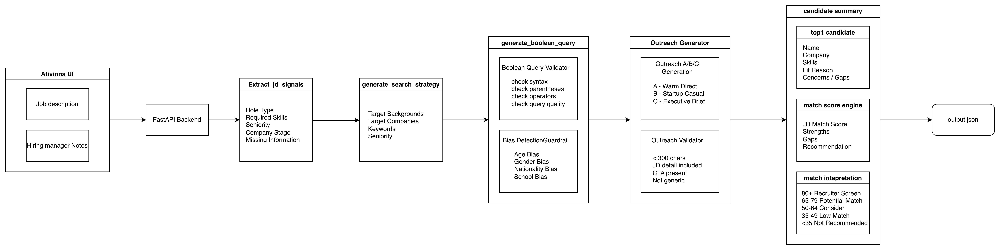

# Atvinna Recruiting Copilot

Atvinna is an AI recruiting copilot agent. A recruiter pastes a Job Description
and optional hiring manager notes, then Atvinna runs a structured recruiting
workflow that produces a sourcing strategy, Boolean query, personalized
outreach, candidate summary, and execution trace.

The project can run as a CLI with:

```bash
python main.py
```

It also includes a React + FastAPI dashboard for a recruiter-friendly UI.

## Workflow



Atvinna keeps the AI work separated into five LLM calls. Candidate matching is
handled locally between Boolean query generation and outreach, so the outreach
message can be written to a real selected candidate rather than a generic
placeholder.

The generated result is saved here:

[output.json](output.json)

## How To Run

Set up the project on a clean machine:

```bash
git clone <repo-url>
cd Atvinna
python -m venv .venv
source .venv/bin/activate
pip install -r requirements.txt
```

Create a root `.env` file:

```bash
MISTRAL_API_KEY=your_mistral_api_key_here
MISTRAL_MODEL=mistral-small-latest
```

Run the CLI:

```bash
python main.py
```

Paste the Job Description when prompted. Finish each multiline input with a
line containing only:

```text
END
```

The command makes five real Mistral API calls and writes `output.json` in the
repository root. There are no hardcoded LLM responses in the production flow.

## Dashboard

Start the FastAPI backend:

```bash
uvicorn backend.main:app --reload
```

Start the React frontend in a second terminal:

```bash
cd frontend
npm install
npm run dev
```

Open:

```text
http://localhost:5173
```

The dashboard sends:

```http
POST /api/run-pipeline
```

with:

```json
{
  "job_description": "Your JD text",
  "hiring_manager_notes": "Optional notes"
}
```

The dashboard does not prefill a JD. The recruiter provides the Job Description
and notes.

## Step By Step

### Step 1: Extract JD Signals

`extract_jd_signals`

The first LLM call extracts structured signals from the JD:

- role type
- required skills
- seniority indicators
- seniority level
- company or team context
- dynamic skill aliases
- adjacent candidate backgrounds
- missing information
- one exact JD detail for outreach

This step turns raw JD text into a schema the rest of the pipeline can use.

### Step 2: Generate Search Strategy

`generate_search_strategy`

The second LLM call converts the JD signals into a sourcing strategy:

- target backgrounds
- target company types
- keywords
- seniority

When the JD includes years of experience, seniority is formatted as
`level, yoe`, for example:

```text
senior, 5+ years
mid, 3-5 years
```

If the JD does not state years of experience, Atvinna uses:

```text
no YOE stated
```

### Step 3: Generate Boolean Query

`generate_boolean_query`

The third LLM call creates one sourcing-style Boolean query from the search
strategy. The query is then validated locally for:

- balanced parentheses
- at least one `AND` or `OR`
- no empty quotes
- no repeated operators such as `AND AND`
- enough searchable terms
- no obvious protected-class filters

If validation fails, Step 3 retries with the exact validation feedback.

### Step 4.1 Local Candidate Matching

After Step 3, Atvinna loads candidates from:

[backend/data/candidates.json](backend/data/candidates.json)

The local scorer evaluates every candidate against the extracted JD signals,
search strategy, and hiring manager notes. This is deterministic Python logic,
not another LLM step.

The selected top candidate is passed into outreach and summary generation.
This is why outreach can start with a real candidate name.

### Step 4.2: Generate Outreach

`generate_outreach_message`

The fourth LLM call generates three outreach variants:

- `warm_direct`
- `startup_casual`
- `executive_brief`

Each variant is validated locally:

- under 300 characters
- includes the selected candidate first name
- includes one exact detail from the JD
- avoids generic recruiting phrases
- ends with a simple low-pressure CTA

If all variants fail, Atvinna retries up to three attempts. Each attempt is
recorded in `pipeline_trace`.

### Step 5.1: Generate Candidate Summary

`generate_candidate_summary`

The fifth LLM call summarizes the locally selected candidate using:

- the original JD
- JD signals
- search strategy
- Boolean query
- outreach result
- candidate profile
- local match evidence

The summary is validated so it matches the locally selected candidate.

## Step 5.2 Candidate Matching And Interpretation

Candidate scoring is designed to be explainable and domain-neutral. It does not
use a hardcoded software, finance, or industry-specific vocabulary. Match
signals come from the current JD, hiring manager notes, and candidate profiles.

The local score uses:

- required skills
- target background and role fit
- keywords and tools
- seniority or context
- hiring manager preferences

Atvinna shows one overall match percentage and a recruiter-facing label:

```text
80-100: Recruiter Screen
65-79:  Potential Match
50-64:  Consider
35-49:  Low Match
Below 35: Not Recommended
```

The dashboard keeps the candidate cards compact: name, company, score,
interpretation, top matched skills, and a concise explanation.

## Additional Handlers

### 1. Ambiguous Seniority

Atvinna does not invent seniority. If the JD is unclear, Step 1 records missing
information and Step 2 chooses a conservative sourcing range. This prevents an
ambiguous role from being silently treated as senior.

### 2. Candidate Database

The current sample database contains six software-engineering candidates:

- Sophia Martinez: new grad frontend engineer
- Maya Chen: early-career AI software engineer
- Daniel Brooks: backend software engineer
- Priya Nair: AI / machine learning engineer
- Marcus Reed: senior software engineer
- Shuzhu Chen: AI/ML full-stack engineer

The scoring logic itself is not limited to software roles. The database can be
replaced with candidates from another domain as long as they follow the same
schema.

### 3. Boolean Query Checks

Atvinna validates the Boolean query before writing the final output. Invalid
queries trigger retries, and any remaining warnings are preserved in
`pipeline_trace`.

### 4. Recruiting Bias Checks

Atvinna scans the JD, strategy, Boolean query, and outreach message for risky
patterns such as:

- age-coded language
- gender-coded language
- nationality or language restrictions
- school prestige filters
- overly narrow company targeting

The guardrail records warnings in `pipeline_trace` without changing the
required output schema.

### 5. Outreach Self-Correction

Outreach is not trusted just because the LLM generated it. The message must
pass local checks for length, specificity, tone, candidate name, JD detail, and
CTA. Failed attempts are logged and re-prompted with the exact failure reason.

## Sample Run

Paste the sample description:

```text
Company name: Tiktok
Senior Backend Software Engineer - Innovative Growth
Location: San Jose

Employment Type: Regular

Responsibilities
We are building the next generation of growth and content optimization systems for TikTok, powered by AIGC technologies and innovative search and discovery strategies. Our mission is to drive user growth and improve user experience through intelligent content optimization, scalable backend systems, and new growth opportunities across evolving digital ecosystems.
Our team operates at the intersection of product, data, engineering, and AI-driven content technologies, turning new ideas and technical advances into scalable, real-world growth solutions used by millions of users. We work closely with product, algorithm, data, and design partners to ensure that advanced technologies translate into measurable business impact and intuitive user experiences across TikTok surfaces such as Web, Lite, and other emerging platforms.

Responsibilities
- Design and develop backend systems that power user growth and content optimization across TikTok platforms
- Drive innovative growth initiatives across search, discovery, and other emerging traffic channels
- Develop AIGC-powered solutions and scalable systems for content optimization, experimentation, and automated workflows
- Build and improve core growth and content systems with strong ownership of scalability, reliability, and performance
- Lead complex projects end-to-end, from technical design to production rollout, with strong ownership of quality and business impact
- Partner closely with product, data, algorithm, and design teams to deliver cross-functional technical solutions
- Contribute to engineering excellence through strong technical design, code quality, operational best practices, and system reliability

Qualifications

Minimum Qualifications
- Bachelor’s degree or above in Computer Science or a related field
- 3+ years of industry experience in backend engineering or distributed systems
- Strong experience designing and building large-scale backend services or consumer-facing platforms
- Experience working on content, growth, recommendation, experimentation, or search-related systems
- Proficiency in one or more of the following languages: Go, Python, Java, or C++
- Strong system design, problem-solving, and software engineering skills
- Good communication skills and the ability to collaborate effectively across teams

Preferred Qualifications
- Experience with AIGC, LLM applications, agent frameworks, AI coding tools, or workflow automation systems
- Experience building data-driven optimization or experimentation platforms
- Experience delivering user-facing products from concept to production in a fast-paced environment
- Interest in search, discovery, and growth ecosystems, including areas such as SEO, GEO, or emerging AI-driven traffic channels
- Experience with AI agents or agentic workflows, and interest in applying them to engineering efficiency and product development

Job Information

【For Pay Transparency】Compensation Description (Annually)

The base salary range for this position in the selected city is $212800 - $387600 annually.​

Compensation may vary outside of this range depending on a number of factors, including a candidate’s qualifications, skills, competencies and experience, and location. Base pay is one part of the Total Package that is provided to compensate and recognize employees for their work, and this role may be eligible for additional discretionary bonuses/incentives, and restricted stock units.​

Benefits may vary depending on the nature of employment and the country work location. Employees have day one access to medical, dental, and vision insurance, a 401(k) savings plan with company match, paid parental leave, short-term and long-term disability coverage, life insurance, wellbeing benefits, among others. Employees also receive 10 paid holidays per year, 10 paid sick days per year and 17 days of Paid Personal Time (prorated upon hire with increasing accruals by tenure).​

The Company reserves the right to modify or change these benefits programs at any time, with or without notice.​

For Los Angeles County (unincorporated) Candidates:​

Qualified applicants with arrest or conviction records will be considered for employment in accordance with all federal, state, and local laws including the Los Angeles County Fair Chance Ordinance for Employers and the California Fair Chance Act. Our company believes that criminal history may have a direct, adverse and negative relationship on the following job duties, potentially resulting in the withdrawal of the conditional offer of employment:​

1. Interacting and occasionally having unsupervised contact with internal/external clients and/or colleagues;​

2. Appropriately handling and managing confidential information including proprietary and trade secret information and access to information technology systems; and​

3. Exercising sound judgment.​
```

Generated output:

[output.json](output.json)

Run local checks:

```bash
python -m unittest discover -s backend/tests
python -m compileall backend main.py
cd frontend && npm run build
```

## Brief Write-Up

### What would you improve with another week?

With another week, I would improve the system in three areas.

First, I would add embedding-based matching on top of the current deterministic
scoring. The current scoring logic is inspectable, but it can miss equivalent
experience when the wording differs between the JD and candidate profile.
Embeddings would help compare responsibilities and background more
semantically.

Second, I would improve the candidate data layer. The current version uses a
fixed local `candidates.json` file so the workflow can run end-to-end. A more
complete version would support uploading resumes, CSV files, or JSON candidate
lists.

Third, I would improve recruiter actions after matching. Recruiters should be
able to review multiple candidates above a threshold, choose who to contact,
edit outreach drafts, and export results.

### What did you notice that was not explicitly stated?

The assignment asks for a candidate summary, but it does not fully define where
the candidate comes from. In a real recruiting workflow, a recruiter reviews a
pool of candidates, not a single abstract profile. That is why Atvinna includes
a local candidate database and deterministic scoring layer.

I also noticed that outreach needs candidate selection to happen first. Without
a selected candidate, the message cannot naturally say something like "Hi Marcus, ...".

Finally, the trace is more than logging. It is evidence that the workflow
actually ran as separate steps instead of one hidden prompt.

### Why five steps instead of one?

Each step has a different responsibility and a different validation point.
Step 1 extracts JD facts. Step 2 turns those facts into a sourcing strategy.
Step 3 creates a Boolean query. Step 4 writes and validates outreach. Step 5
summarizes the selected candidate.

If Steps 1 and 2 were collapsed, the agent could mix raw JD facts with sourcing
assumptions. It might invent seniority, skip missing information, over-focus on
prestige companies, or generate keywords without showing which JD signals they
came from.

### Which parts used AI and which parts required human judgment?

AI was used for the language-heavy steps: extracting JD signals, creating the
search strategy, generating the Boolean query, drafting outreach variants, and
writing the selected candidate summary.

Human judgment was required to design the system boundaries: schemas, five-step
orchestration, local scoring, retry behavior, validation rules, trace logging,
score interpretation, and recruiting guardrails. The AI generates content, but
the application decides what is acceptable, traceable, and safe to use.
